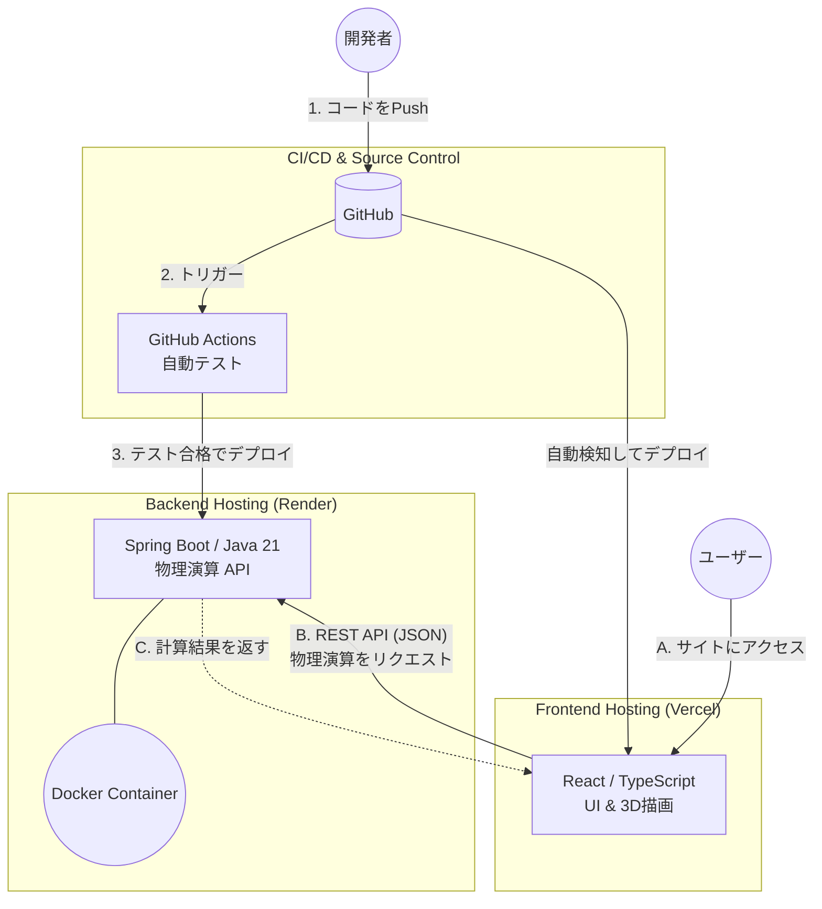

# ダーツ物理シミュレーター

*他の言語で読む: [English](README.md), [日本語](README.ja.md)*

インタラクティブな3Dダーツ物理シミュレーションと、セッティング最適化のためのWebアプリケーションです。3D描画を担当するReact/TypeScriptフロントエンドと、物理演算を担当するSpring Boot/Javaバックエンドを分離した、疎結合なクラウドネイティブアーキテクチャを採用しています。

🚀 **[ライブデモ](https://your-app.vercel.app)** *(※ご自身のVercelのURLに変更してください)*
🔗 **APIエンドポイント:** `https://darts-sim-api.onrender.com/api`

---

## 🎯 主な機能

- **3D物理演算ビジュアライゼーション:** バレル/シャフトの重量配分や空気抵抗を考慮した、ダーツの軌道をリアルタイムで描画します。
- **セッティングシミュレーター:** バレル、シャフト、フライトの様々な組み合わせをインタラクティブにテストできます。
- **物理演算エンジン:** バレルの重量、シャフトの長さ、フライトの空気抵抗などのパラメータに基づいてダーツの飛行軌道を計算します。
- **コンテナ化アーキテクチャ:** マルチステージビルドによる完全なDocker化で、ローカルから本番環境まで一貫した実行環境を保証します。
- **自動化されたCI/CD:** GitHub Actionsによるフロントエンド・バックエンド両方の自動テスト・デプロイパイプライン。

---

## 🛠 技術スタック

### フロントエンド (`darts-sim-web`)

| | |
|---|---|
| フレームワーク | React 18 (TypeScript) |
| ビルドツール | Vite |
| ホスティング | Vercel |

### バックエンド (`darts-sim-api`)

| | |
|---|---|
| 言語 | Java 21 |
| フレームワーク | Spring Boot 3 |
| ビルドツール | Maven |
| コンテナ化 | Docker |
| ホスティング | Render |

---

## 🏗 システムアーキテクチャ

UIの描画処理と、重い物理演算を分離するための疎結合アーキテクチャを採用しています。



---

## 🚀 ローカル環境の構築手順

### 前提条件

- **Node.js** v18以上
- **Java 21 (JDK)**
- **Maven** (任意 — Maven Wrapperが同梱されています)
- **Docker** (任意 — バックエンドをコンテナで実行する場合)

### リポジトリのクローン

```bash
git clone https://github.com/haku3782/darts-sim.git
cd darts-sim
```

### フロントエンド

```bash
cd darts-sim-web
npm install
npm run dev
```

ブラウザで `http://localhost:5173` を開きます。

> ローカルでAPIデータを取得するには、バックエンドが `http://localhost:8080` で起動していることを確認してください。

### バックエンド

```bash
cd darts-sim-api
./mvnw spring-boot:run
# Windowsの場合: mvnw.cmd spring-boot:run
```

APIサーバーが `http://localhost:8080` で起動します。

#### Dockerでの実行

```bash
cd darts-sim-api
docker build -t darts-sim-api .
docker run -p 8080:8080 darts-sim-api
```

---

## 📈 CI/CDとデプロイ

| | ホスティング | デプロイトリガー |
|---|---|---|
| フロントエンド | Vercel | `main` ブランチへのPushで自動デプロイ |
| バックエンド | Render (Docker) | `main` ブランチへのPushで自動デプロイ |

統合されたGitHub Actionsワークフロー（`.github/workflows/ci.yml`）により、pushのたびにフロントエンドのビルド/テストとバックエンドのユニットテストが両方実行されます。
