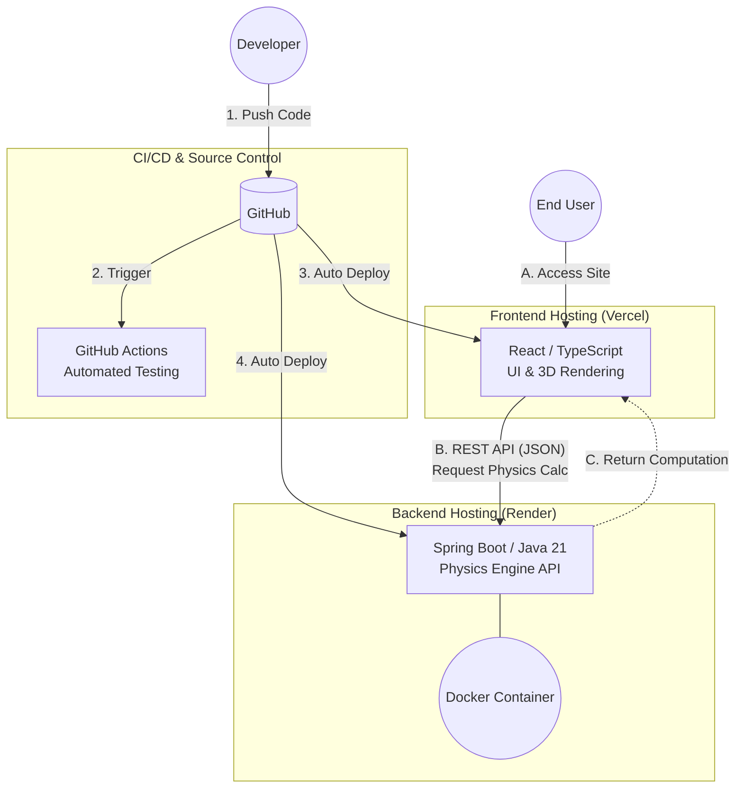

# Darts Physics Simulator

*Read this in other languages: [English](README.md), [日本語](README.ja.md)*

An interactive 3D darts physics simulation and setting optimization web application. Built with a decoupled cloud-native architecture — a React/TypeScript frontend for 3D rendering and a Spring Boot/Java backend for physics computation.

🚀 **[Live Demo](https://darts-sim-web.vercel.app/)**
🔗 **API Endpoint:** `https://darts-sim-api.onrender.com/api`

---

## 🎯 Key Features

- **3D Physics Visualization:** Real-time rendering of dart trajectories, factoring in barrel/shaft weight distribution and aerodynamics.
- **Setting Simulator:** Interactive configuration to test different combinations of barrels, shafts, and flights.
- **Physics Engine:** Calculates dart flight paths based on parameters such as barrel weight, shaft length, and flight drag.
- **Containerized Architecture:** Fully Dockerized backend using multi-stage builds for consistent environments from local to production.
- **Automated CI/CD:** GitHub Actions pipeline for automated testing of both frontend and backend.

---

## 🛠 Tech Stack

### Frontend (`darts-sim-web`)

| | |
|---|---|
| Framework | React 19 (TypeScript) |
| Build Tool | Vite |
| 3D Rendering | Three.js / React Three Fiber |
| Hosting | Vercel |

### Backend (`darts-sim-api`)

| | |
|---|---|
| Language | Java 21 |
| Framework | Spring Boot 4 |
| Build Tool | Maven |
| Containerization | Docker |
| Hosting | Render |

---

## 🏗 System Architecture

---

## 📈 CI/CD & Deployment

| | Hosting | Trigger |
|---|---|---|
| Frontend | Vercel | Auto-deploy on push to `main` |
| Backend | Render (Docker) | Auto-deploy on push to `main` |

A unified GitHub Actions workflow (`.github/workflows/ci.yml`) runs frontend build/test and backend unit tests on every push. Vercel and Render each watch the repository independently and deploy automatically when the `main` branch is updated.
